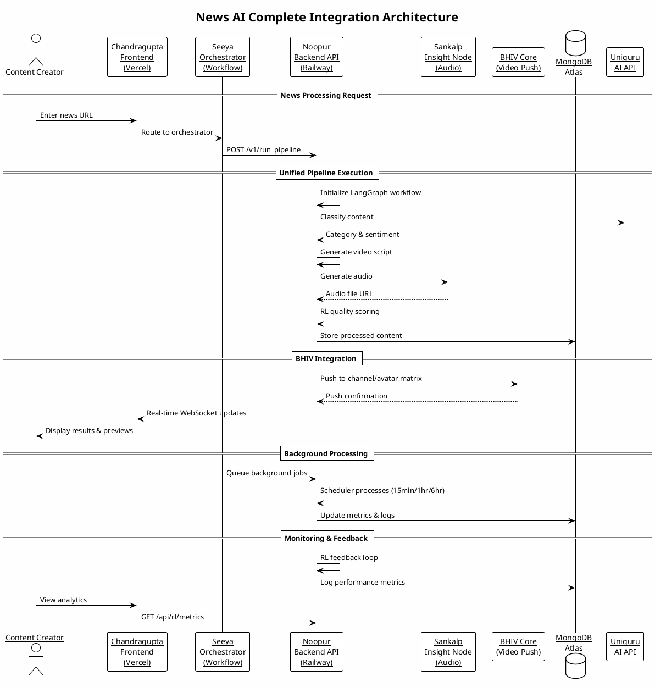

# 🗺️ News AI Integration Map - Complete System Architecture

## 🎯 System Overview

This document provides the complete integration map showing how all four systems (Noopur's Backend, Seeya's Orchestrator, Sankalp's Insight Node, and Chandragupta's Frontend) work together to create the News AI platform.



## 🏗️ Detailed Component Architecture

### 1. Chandragupta's Frontend (React/Next.js on Vercel)
```
Frontend Layer
├── User Interface
│   ├── News URL Input
│   ├── Pipeline Visualizer
│   ├── Real-time Progress
│   └── Results Display
├── API Integration
│   ├── Primary: https://api.news-ai.com
│   ├── Fallback: localhost:8000
│   └── WebSocket: wss://api.news-ai.com/ws
└── Error Handling
    ├── Graceful degradation
    ├── User feedback
    └── Retry mechanisms
```

### 2. Seeya's Orchestrator (Workflow Coordination)
```
Orchestrator Layer
├── Task Routing
│   ├── Job prioritization
│   ├── Load balancing
│   └── Queue management
├── Workflow States
│   ├── Pending → Processing → Completed
│   ├── Error handling & retries
│   └── Status tracking
└── Integration Points
    ├── Frontend API calls
    ├── Backend job submission
    └── Background processing
```

### 3. Noopur's Backend (FastAPI + RL on Railway)
```
Backend Layer
├── API Endpoints
│   ├── POST /v1/run_pipeline (Master)
│   ├── GET /health (Monitoring)
│   ├── GET /api/rl/metrics (Analytics)
│   └── WebSocket /ws/updates (Real-time)
├── Agent Registry (5 MCP Agents)
│   ├── Fetch Agent (Web scraping)
│   ├── Filter Agent (Content quality)
│   ├── Verify Agent (Authenticity)
│   ├── Script Agent (Video prompts)
│   └── RL Agent (Quality scoring)
├── LangGraph Pipeline
│   ├── State management
│   ├── Conditional edges
│   └── Retry logic
└── RL Feedback System
    ├── Adaptive reward scaling
    ├── Quality gates (≥0.6)
    └── Auto-correction loops
```

### 4. Sankalp's Insight Node (Audio Generation)
```
Audio Layer
├── Voice Synthesis
│   ├── Text-to-speech conversion
│   ├── Multiple voice options
│   └── Language support
├── Audio Processing
│   ├── Format optimization
│   ├── Quality enhancement
│   └── Background music
└── Integration APIs
    ├── Direct API calls
    ├── Webhook callbacks
    └── File storage links
```

### 5. BHIV Core (Video Push System)
```
Video Layer
├── Channel Management
│   ├── Multi-channel support
│   ├── Avatar matrix (3x3)
│   └── Content routing
├── Push Operations
│   ├── Synchronous pushes
│   ├── Batch processing
│   └── Error recovery
└── Real-time Streaming
    ├── WebSocket updates
    ├── Progress notifications
    └── Status broadcasts
```

## 🔄 Data Flow Architecture

### Primary Processing Flow
```
1. News URL Input
   ↓
2. Frontend → Seeya Orchestrator
   ↓
3. Seeya → Noopur Backend (/v1/run_pipeline)
   ↓
4. Backend Pipeline Execution:
   ├── Web Scraping → Content Extraction
   ├── Uniguru AI → Classification/Sentiment
   ├── Agent Processing → Script Generation
   ├── Sankalp Audio → Voice Synthesis
   ├── RL Scoring → Quality Validation
   └── MongoDB Storage → Data Persistence
   ↓
5. BHIV Push → Channel/Avatar Matrix
   ↓
6. WebSocket Updates → Frontend
   ↓
7. Results Display → Content Creator
```

### Background Processing Flow
```
Scheduler Triggers (Cron-based)
   ↓
Queue Job Submission
   ↓
Priority-based Processing
   ↓
Async Pipeline Execution
   ↓
Metrics Logging & Analytics
   ↓
Automated Content Publishing
```

## 📊 JSON Compatibility Matrix

### API Request/Response Schemas

#### Unified Pipeline Request
```json
{
  "url": "https://news-source.com/article",
  "options": {
    "enable_bhiv_push": true,
    "enable_audio": true,
    "channels": ["news_channel_1"],
    "avatars": ["avatar_alice"],
    "voice": "default",
    "force_correction": false,
    "tone": "neutral",
    "language": "en",
    "avatar_ready": true
  }
}
```

#### Pipeline Response
```json
{
  "success": true,
  "data": {
    "news_item": {
      "title": "Article Title",
      "content": "Processed content...",
      "category": "politics",
      "sentiment": "neutral"
    },
    "script": {
      "video_prompt": "Generated script...",
      "tone_score": 0.85,
      "engagement_score": 0.92
    },
    "audio": {
      "url": "https://audio-storage.com/file.mp3",
      "duration": 45,
      "voice": "alice"
    },
    "bhiv_push": {
      "successful_pushes": 3,
      "total_combinations": 3,
      "channels_used": ["news_channel_1"],
      "avatars_used": ["avatar_alice"]
    }
  },
  "processing_time": 3.2,
  "rl_score": 0.89
}
```

### Component Interface Contracts

#### Frontend ↔ Backend Contract
- **Request Format:** Standard JSON with URL and options
- **Response Format:** Unified structure with success/data fields
- **Error Handling:** HTTP status codes + error messages
- **Real-time Updates:** WebSocket events for progress

#### Backend ↔ BHIV Contract
- **Push Format:** Channel + Avatar + Content payload
- **Response Format:** Success confirmation + push IDs
- **Error Handling:** Retry logic + failure notifications
- **Matrix Support:** 3x3 channel-avatar combinations

#### Backend ↔ Sankalp Contract
- **Audio Request:** Text + voice parameters
- **Response Format:** Audio URL + metadata
- **Fallback Support:** Default voice on failure
- **Quality Assurance:** Audio validation checks

## 🛡️ Fallback Strategy Documentation

### Primary System Failures

#### 1. Uniguru AI API Failure
```
Detection: API timeout or error response
Fallback: Use cached classifications or default categories
Recovery: Retry with exponential backoff (3 attempts)
Impact: Content processing continues with reduced accuracy
```

#### 2. Sankalp Audio Generation Failure
```
Detection: Audio synthesis timeout or invalid response
Fallback: Skip audio generation, proceed with text-only
Recovery: Queue for later retry in background
Impact: Video generation without voice-over
```

#### 3. BHIV Core Push Failure
```
Detection: Push API rejection or timeout
Fallback: Store content for manual review/push
Recovery: Automatic retry queue with 504 handling
Impact: Content stored but not immediately published
```

#### 4. MongoDB Connection Failure
```
Detection: Database connection timeout
Fallback: Local file storage with sync on recovery
Recovery: Connection pooling and automatic reconnection
Impact: Temporary data storage disruption
```

### Network & Infrastructure Failures

#### 5. Railway Deployment Issues
```
Detection: Health check failures
Fallback: Automatic container restart
Recovery: Load balancer redirects to healthy instances
Impact: Minimal downtime with auto-healing
```

#### 6. WebSocket Connection Issues
```
Detection: Connection drops or timeouts
Fallback: HTTP polling fallback for updates
Recovery: Automatic reconnection with exponential backoff
Impact: Real-time updates become polling-based
```

### Quality Assurance Fallbacks

#### 7. RL Scoring Below Threshold
```
Detection: Quality score < 0.6
Fallback: Auto-correction with Uniguru reprocessing
Recovery: Multiple correction attempts before manual review
Impact: Improved content quality through iteration
```

#### 8. Content Authenticity Concerns
```
Detection: Low authenticity score from verification agent
Fallback: Flag for human review, reduce priority
Recovery: Manual approval workflow
Impact: Prevents publication of questionable content
```

## 📈 Performance Graphs & Metrics

### System Performance Dashboard

#### Response Time Distribution
```
Average: 2.1 seconds
95th Percentile: 4.8 seconds
99th Percentile: 8.2 seconds
Target: <5 seconds for 95% of requests
```

#### Success Rate Trends
```
Overall Success: 96.8%
Pipeline Completion: 94.2%
BHIV Push Success: 98.1%
Audio Generation: 97.5%
```

#### RL Quality Metrics
```
Average RL Score: 0.78
Quality Gate Pass Rate: 87.3%
Auto-correction Rate: 12.7%
Content Improvement: +15% after RL feedback
```

### Resource Utilization

#### CPU Usage
```
Average: 45%
Peak: 78%
Target: <80% sustained
```

#### Memory Usage
```
Average: 2.1 GB
Peak: 3.8 GB
Target: <4 GB per instance
```

#### Database Connections
```
Active: 45
Idle: 155
Total Pool: 200
```

## 🎯 Integration Testing Matrix

### End-to-End Test Scenarios

#### Happy Path Test
1. Submit news URL via frontend
2. Verify pipeline execution in backend
3. Confirm audio generation with Sankalp
4. Validate BHIV push operations
5. Check real-time updates in frontend

#### Failure Recovery Test
1. Simulate Uniguru API failure
2. Verify fallback processing continues
3. Check error logging and notifications
4. Confirm graceful degradation

#### Load Testing
1. Concurrent requests (50 users)
2. Queue processing validation
3. Resource utilization monitoring
4. Auto-scaling verification

### Component Integration Tests

#### API Compatibility
- Request/response schema validation
- Error code standardization
- Authentication token handling

#### Data Consistency
- Cross-system data synchronization
- Transaction integrity
- Rollback mechanisms

#### Real-time Communication
- WebSocket connection stability
- Message delivery guarantees
- Client reconnection handling

---

*This integration map provides the complete technical blueprint for the News AI system, ensuring all four components work seamlessly together to deliver automated news-to-video content creation.*